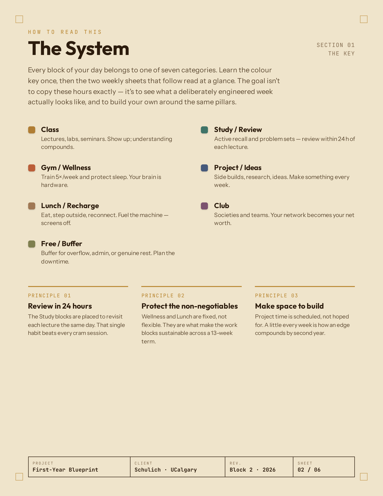
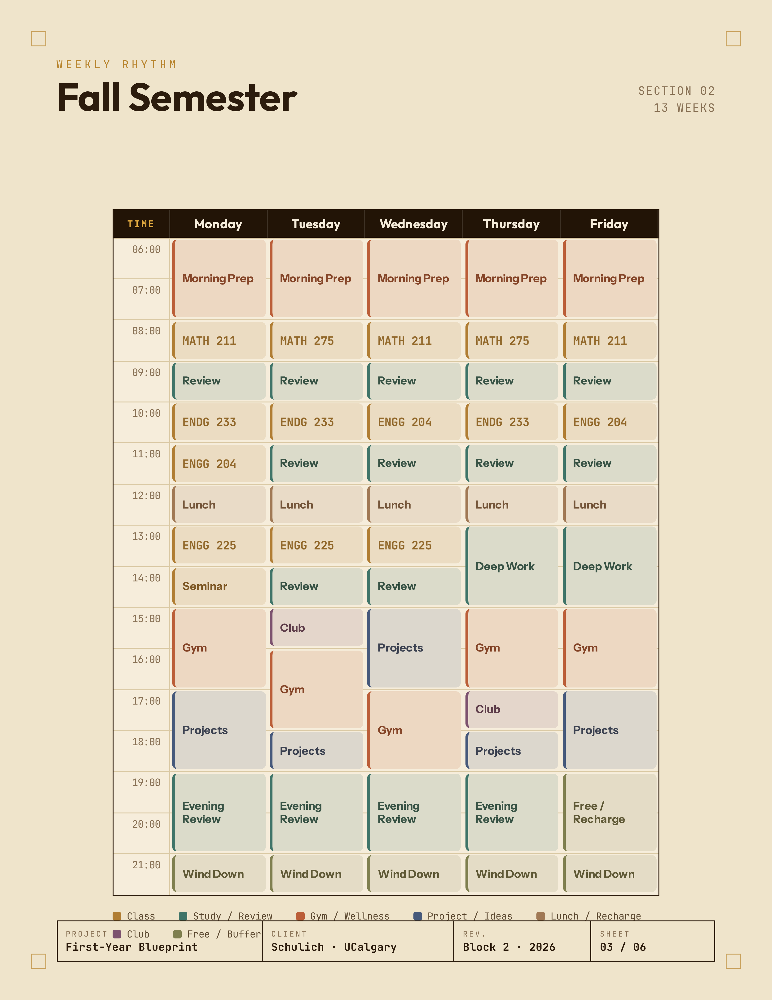
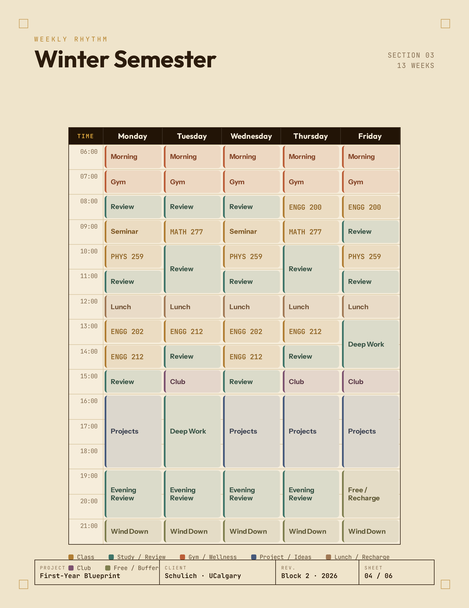
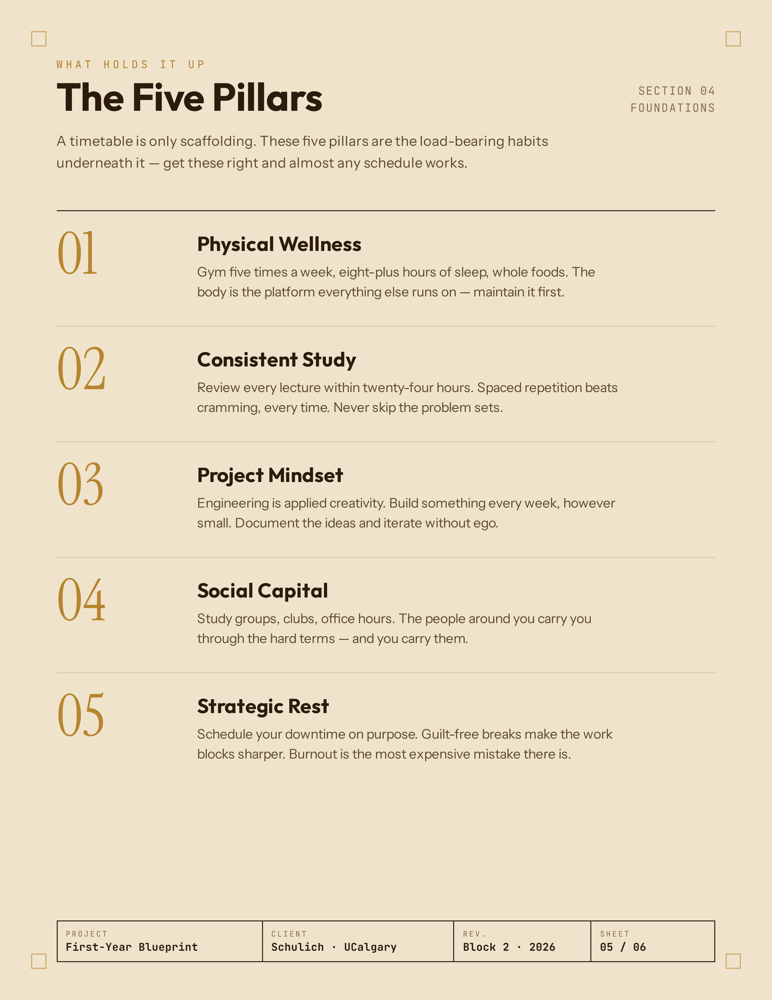

# EngInQuire Blueprint Generator

Generates a personalized **Field Guide / Daily Blueprint** — a print-ready, multi-page PDF-style document — for incoming first-year Schulich engineering students. Students pick their class block, semester, and a few preferences (housing/commute, wake-up time, gym, study rhythm, social life); the app arranges flexible activities around their real class times and lays the result out as a cover page, key/legend page, weekly rhythm page, five-pillars page, and contact page, matching EngInQuire's Field Guide branding.

Designed to be linked directly from something like Linktree — students land on the form, fill it out, and get a shareable page they can save as a PDF ("Save as PDF" triggers the browser print dialog, styled for letter-size print).

## Preview

Sample output for Block 2, Fall/Winter — every class time is real, everything else is generated around it.

<table>
<tr>
<td></td>
<td></td>
</tr>
<tr>
<td></td>
<td></td>
</tr>
<tr>
<td></td>
<td></td>
</tr>
</table>

## How it works

1. **Fixed classes are never AI-generated.** They come straight from [api/blocks.json](api/blocks.json) (10 blocks × fall/winter semesters) and are looked up by block number — the model never invents or moves a class.
2. The student's structured preferences (housing/commute, day start/end, gym count, study style, social level) and free-text notes are turned into explicit instructions and sent to **Google Gemini** (`gemini-2.5-flash`) to arrange only the *flexible* blocks (Prep, Commute, Study, Gym, Project, Lunch, Club, Free, WindDown) around the fixed classes.
3. The model's JSON response is **strictly validated** server-side before anything is returned: blocks with bad times, unknown categories, or overlaps with a real class or another flexible block are dropped. If the model's response fails to parse, the server retries once, then fails gracefully.
4. The client ([public/index.html](public/index.html)) renders the validated plan as the multi-page Field Guide (cover, key, weekly grid, five pillars, contact) and lets the student print/save it as a PDF.
5. If a lead-capture key is configured, the student's name/email/block is logged via Web3Forms; this is best-effort and never blocks generation.

## Project structure

```
public/
  index.html       # the form students fill out + the rendered Field Guide UI (print-to-PDF)
api/
  generate.js      # serverless function — holds the Gemini key, builds the prompt, validates output
  blocks.json       # verified fixed class times for every block × semester
vercel.json         # routes "/" to index.html
package.json         # Node >=18
SETUP.md             # step-by-step deployment guide (API keys, Vercel, Linktree)
```

## Running / deploying

This app has no build step — `api/generate.js` is a Vercel serverless function and `public/index.html` is static. See [SETUP.md](SETUP.md) for the full walkthrough, summarized here:

1. Get a free [Gemini API key](https://aistudio.google.com/apikey) (keep billing off to stay on the free tier).
2. (Optional) Get a [Web3Forms](https://web3forms.com) access key for lead capture.
3. Deploy the repo on [Vercel](https://vercel.com), setting environment variables:
   - `GEMINI_API_KEY` (required)
   - `WEB3FORMS_KEY` (optional)
4. Vercel gives you a URL — that's the product.

## Updating class data

Edit [api/blocks.json](api/blocks.json) with the new verified timetable, commit, and Vercel redeploys automatically. No code changes needed.

## Costs

All free at expected scale: Vercel free tier, Gemini free tier (`gemini-2.5-flash`, ~250 requests/day), Web3Forms free tier (250 submissions/month).
